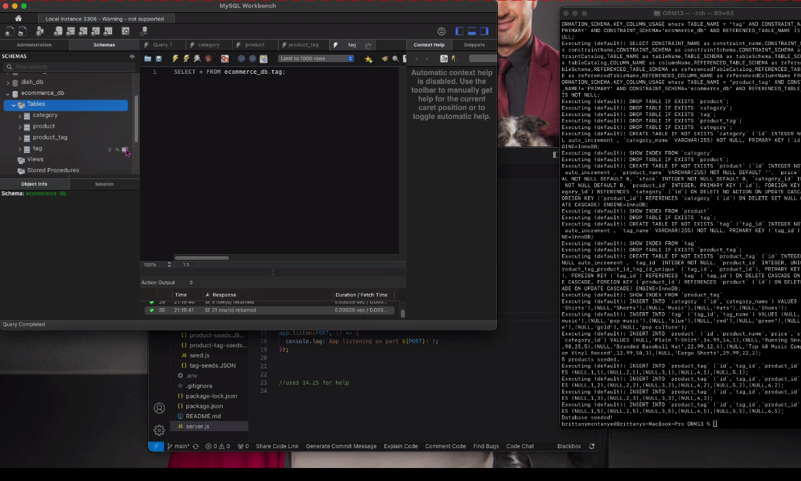

# ORM13 - Retail Database

## Description
This is a backend to a retail site where we can add products, automate tag ids and manage a database using sequelize. 

## Visuals

## Installation
Dependencies required
  "packages": 
    "": {
      "name": "module-13-challenge-orm",
      "version": "1.0.0",
      "license": "ISC",
      "dependencies": {
        "dotenv": "^8.6.0",
        "express": "^4.17.1",
        "mysql": "^2.18.1",
        "mysql2": "^3.9.7",
        "sequelize": "^6.37.3"
      },
      "devDependencies": {
        "nodemon": "^2.0.3"
      }
    },

## Usage
Use for simple database updates and management of inventory. 

## Support
UCF EdEx Bootcamp

## Roadmap
No further roadmap

## Contributing
Open to feedback and assistance. 

## Authors and acknowledgment
Thank you to Wyzant Tutor - Squal. 
Thank you to UCF Coding Bootcamp
Sequelize Docs
Express docs for routing

## License
UNLICENSED

## Project status
this project is done for the time being. 